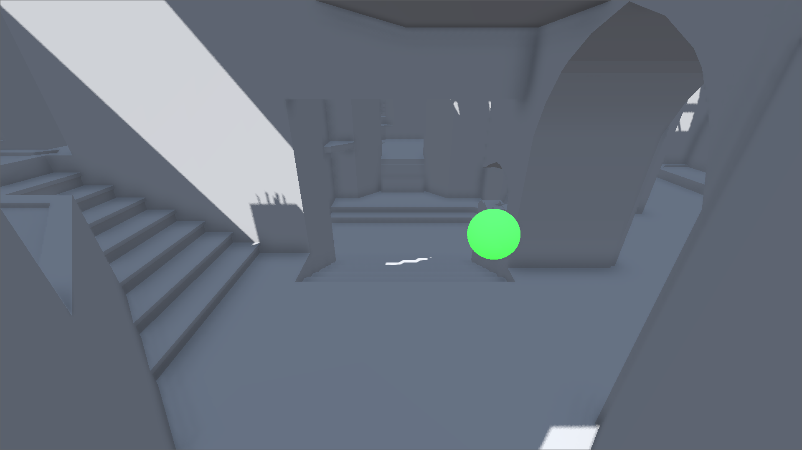
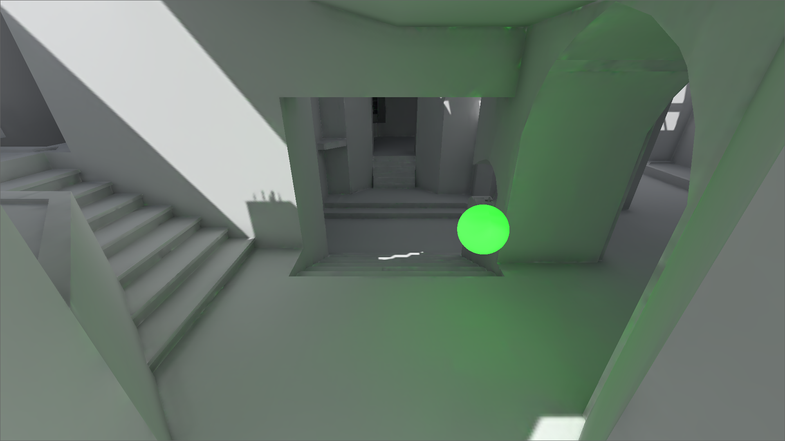

# Lightmapping 예제

그림자가 생기는 직접광인 햇빛과 발광하는 Material을 라이트맵에 적용해보는 Scene 노드입니다.

## 사전 설정
* DirectionalLight3D의 설정을 다음과 같이 세팅합니다.
    * Light -> Bake Mode = Static
    * Shadow -> Enabled = true

* 발광 물체를 나타내는 MeshInstance의 설정을 다음과 같이 세팅합니다.
    * Mesh -> Add UV2 = true
    * Material -> Emission -> Enabled = true
    * Material -> Emission -> Color = White
    * Material -> Emission -> Energy Multiplier = 3 ~ 10

* 라이트맵을 적용시킬 MeshInstance의 설정을 다음과 같이 세팅합니다.
    * Mesh 우클릭 -> Make Unique
    * 에디터 상단의 3D -> Mesh -> Unwrap UV2 for Lightmap/AO
---

## 적용
LightmapGI 노드를 생성하고, LightmapGI를 선택한 상태에서 Bake Lightmaps를 클릭해 Lightmap을 생성하기.

Lightmapping 적용 이전

Lightmapping 적용 이후 (low quality로 제작되었음)

## 헷갈릴 수 있는 것들

### Q. .blend 파일과 같이 모델링 프로그램을 통해 생성된 파일은 어떻게 UV2를 Unwrap하는가?  

### A.
1. 모델 파일을 우클릭하고 New Inherited Scene을 선택합니다.
2. MeshInstance의 Mesh를 우클릭하고 Make Unique로 유일하게 만듭니다.
3. 게임 화면 상단의 Mesh -> Unwrap UV2 for Lightmap/AO를 사용해 UV2를 Unwrap합니다.
4. Godot의 노드 파일인 .tscn 파일로 저장합니다.
5. 해당 .tscn 파일로 노드를 생성해 UV2가 Unwrap된 모델을 사용할 수 있습니다.

## 참고
이 Scene에는 https://github.com/godotengine/godot-demo-projects/tree/master/3d/global_illumination/zdm2.blend 파일이 사용되었습니다.
